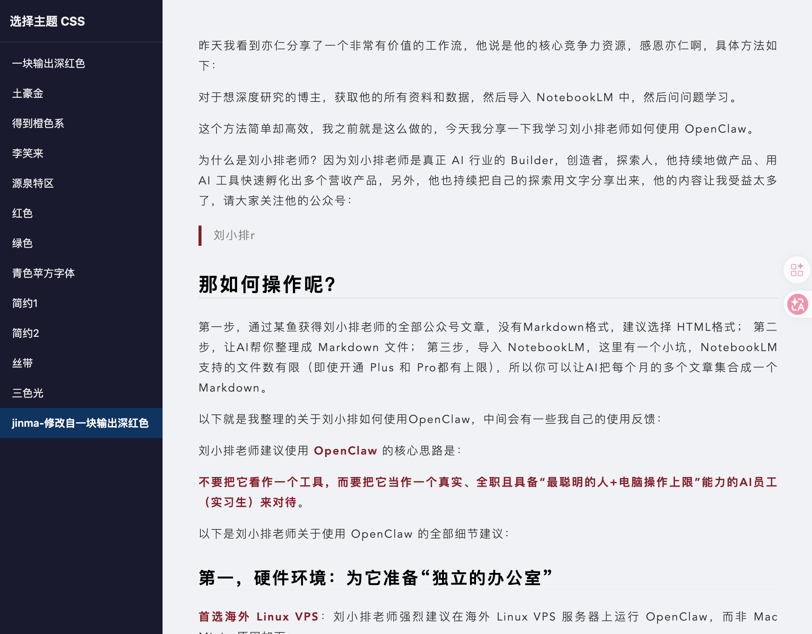

# Markdown Here CSS

微信公众号毫秒级排版，让你的排版充满审美愉悦感。复制 CSS 代码到 "Markdown Here 基本渲染 CSS" 即可。

Fork 自 [huanxi007/markdown-here-css](https://github.com/huanxi007/markdown-here-css)，在此基础上做了以下调整：

## 做了什么调整

1. **文件规范化**：为所有 CSS 文件添加了数字编号前缀（01-12），并补齐了缺失的 `.css` 扩展名
2. **新增主题**：新增了 4 个主题（简约1、简约2、丝带、三色光），由功夫熊猫收集提供
3. **自定义主题**：新增了 `jinma-修改自一块输出深红色.css`，基于「一块输出深红色」主题微调而来
4. **在线预览页面**：新增 `index.html`，可以在浏览器中实时切换预览所有主题效果

## 主题列表

| 编号 | 主题名 |
|------|--------|
| 01 | 一块输出深红色 |
| 02 | 土豪金 |
| 03 | 得到橙色系 |
| 04 | 李笑来 |
| 05 | 源泉特区 |
| 06 | 红色 |
| 07 | 绿色 |
| 08 | 青色苹方字体 |
| 09 | 简约1 |
| 10 | 简约2 |
| 11 | 丝带 |
| 12 | 三色光 |
| - | jinma-修改自一块输出深红色 |

## 如何使用

### 方式一：直接复制 CSS

打开任意 `.css` 文件，复制全部内容，粘贴到 Markdown Here 浏览器扩展的 **"基本渲染 CSS"** 设置中即可。

### 方式二：本地预览（推荐）

本项目提供了 `index.html` 预览页面，可以在浏览器中实时切换查看所有主题效果。由于页面使用了 `fetch` 加载本地文件，**需要通过本地 HTTP 服务器访问**，直接双击打开 `index.html` 会因浏览器安全策略而无法正常加载。

克隆仓库后，在项目根目录下启动一个本地服务器：

**Python（推荐，macOS/Linux 自带）：**

```bash
# Python 3
python3 -m http.server 8000

# Python 2
python -m SimpleHTTPServer 8000
```

**PHP：**

```bash
php -S localhost:8000
```

然后在浏览器中打开 [http://localhost:8000](http://localhost:8000) 即可看到预览页面。

## 预览截图


